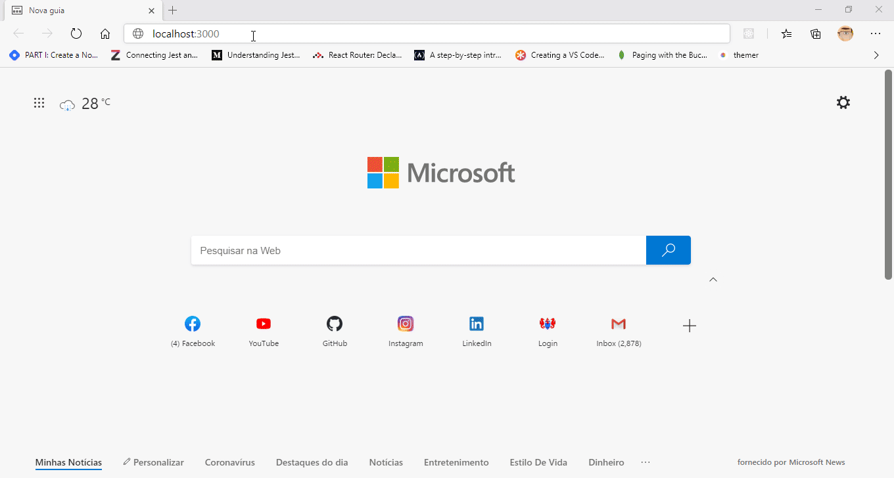

# :desktop_computer: Animated Products Catalog Page
<br>
<p align=center>


<br>

<br><br>

</p>

<br>

> **_An example of component animations and page transitions on a products catalog using NextJS, Styled Components and Framer Motion._**

## :page_facing_up: Overview
This project was made using NextJS framework for React and my goal with it was to learn about the Static Site Generation resource provided by Vercel, and general animations with Framer Motion lib, which I also never tested.

### Main dependencies used:
- NextJS
- Typescript
- Framer Motion
- Styled Components
- JSON Server

## :dvd: Setup
Wanna see this humble project by yourself? Sure :grin: just do the following steps:

__1.__ Make sure you have a *package manager* like [npm](https://www.npmjs.com/ "NPM") or [Yarn](https://yarnpkg.com/ "Yarn") installed in your machine.

__2.__ Download this repository into a directory of your preferrence either by clicking on the *download* button in this repo or by cloning this repo using the [GIT CLI](https://git-scm.com/ "GIT CLI"):

```sh
$ git clone https://github.com/100f/animated-products-page-example.git
```
__3.__ To install it, immediately throw the following commands in your terminal (at the root folder directory)
- npm

  ```sh
  $ npm install
  ```
  
- Yarn

  ```sh
  $ yarn
  ```
__4.__ To actually test it, after making sure you're in the directory's root folder, throw the following command in your terminal to run in dev mode:
- npm
```sh
$ npm run dev
```
- Yarn

```sh
$ yarn dev
```

__4.__ Just run the project in your :globe_with_meridians: browser! It runs at port __3000__, so just access `http://localhost:3000` and give it a try. Cheers!

<hr>
<br>

Made by [Caio Enrique](http://github.com/100f) - Oct, 2020. :eyeglasses:
